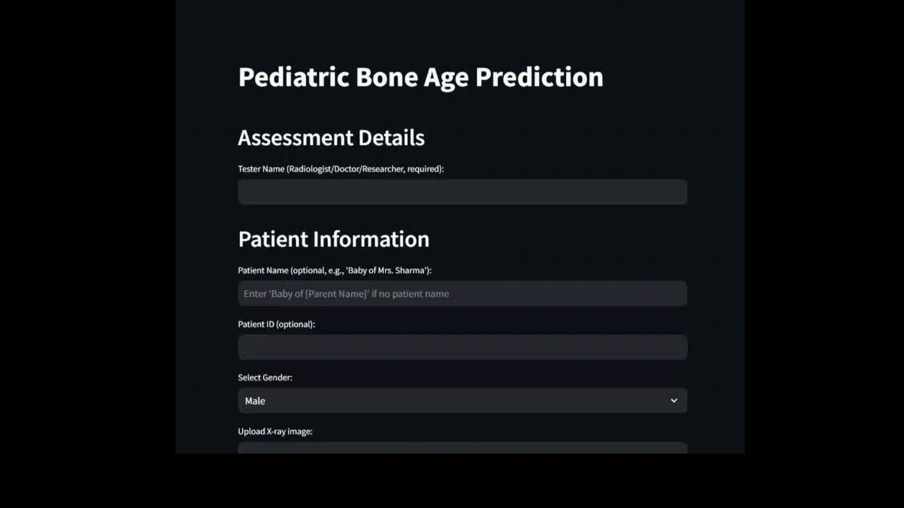

# Pediatric Bone Age Prediction UI

A Streamlit app for predicting pediatric bone age from hand X-ray images using a ResNet50 model. For radiologists, doctors, or researchers.

## Features
- **UI**: Input Tester Name (required), Patient Name (optional, e.g., "Baby of Mrs. Sharma"), Patient ID (optional), Gender. Shows original/preprocessed images and predicted bone age.
- **PDF Report**: Includes tester details, patient info, predicted age, and images.

## Prerequisites
- Python 3.8+
- Git
- `final_best_model.pth`

## Setup and Run

1. **Set Up Virtual Environment**:
   ```bash
   python -m venv venv
   source venv/bin/activate  # Windows: venv\Scripts\activate
   ```

2. **Install Dependencies**:
   ```bash
   pip install -r requirements.txt
   ```

3. **Add Model File**:
   - Place `final_best_model.pth` in the project root.

4. **Run App**:
   ```bash
   streamlit run app.py
   ```
   - Open `http://localhost:8501`.
   - Enter Tester Name, optional Patient Name/ID, Gender, upload X-ray (JPG/PNG), and click "Submit".

## Notes
- Test with grayscale or RGB X-ray images.
- Predictions logged in `predictions.log`.


## Deployed APP
[](https://pediatric-bone-age-prediction-rucci.streamlit.app/?embed_options=dark_theme)


Developed by Ruchi Rathod.
